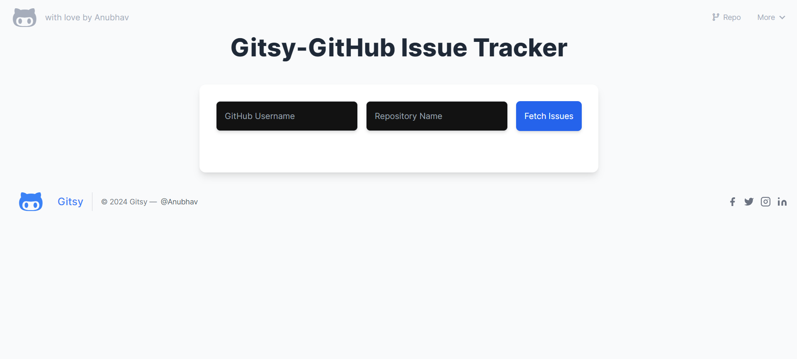
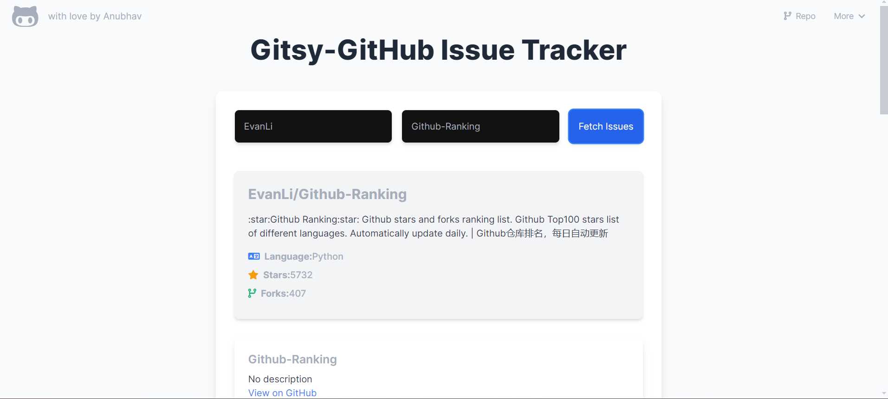
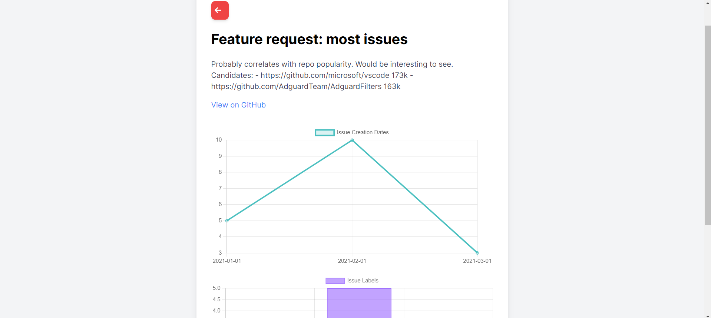

# GitHub Issue Tracker 🚀

A web application that allows users to track issues from any GitHub repository. Users can fetch issues, view detailed information about each issue, and see repository information, all with a clean and modern UI enhanced by Tailwind CSS and FontAwesome icons.

## Features ✨

- 🔍 **Fetch Issues:** Retrieve issues from any public GitHub repository.
- 📄 **Issue Pagination:** Navigate through issues with 10 issues per page.
- 📊 **Detailed View:** View detailed information about each issue, including charts for issue creation dates and labels.
- 📈 **Charts:** Display charts using Chart.js (with placeholders when no data is available).
- 🏷️ **Repository Information:** Display repository name, description, stars, forks, and open issues.
- 🎨 **Modern UI:** A clean and minimal user interface using Tailwind CSS.
- 💎 **Icons:** Visual enhancements using FontAwesome.
- 📱 **Responsive Design:** A better user experience on different devices.

## Demo 🎥

Check out the [demo video](https://www.youtube.com/watch?v=alzW2eTM-oo) to see the app in action!



## Technologies Used 🛠️

- **HTML**
- **CSS** (Tailwind CSS)
- **JavaScript**
- **Chart.js**
- **FontAwesome**

## Installation ⚙️

1. Clone the repository:

    ```bash
    git clone https://github.com/your-username/github-issue-tracker.git
    ```

2. Navigate to the project directory:

    ```bash
    cd github-issue-tracker
    ```

3. Open `index.html` in your favorite web browser to start the application.

## Usage 📝

1. Enter a GitHub username and repository name in the input fields.
2. Click the "Fetch Issues" button to retrieve and display the issues.
3. Click on any issue to view detailed information and charts on a new page.
4. Use the pagination controls to navigate through the issues.
5. View repository information above the issues list.

## Screenshots 📸

### Home Page


### Issues List



### Issue Detail



## Project Structure 📂

```plaintext
github-issue-tracker/
├── index.html
├── detail.html
├── styles.css
├── app.js
├── detail.js
├── screenshots/
│   ├── demo.png
│   ├── home.png
│   ├── issues.png
│   ├── detail.png
│   └── pagination.png
└── README.md
```

index.html: Main page to fetch and display issues and repository information.
detail.html: Detail view page for individual issues.
styles.css: Custom styles and animations.
app.js: Main JavaScript file for fetching issues and repository information.
detail.js: JavaScript file for fetching and displaying issue details and charts.

Contributing 🤝
1.Fork the repository.

2.Create a new branch:

  ```bash
  git checkout -b feature-branch
  ```
3.Make your changes and commit them:

  ```bash
  git commit -m "Add new feature"
  ```

4.Push to the branch:

  ```bash
  git push origin feature-branch
  ```
5.Open a pull request on GitHub.

License 📜
This project is licensed under the MIT License. See the LICENSE file for details.

Contact 📧
For any questions or suggestions, please open an issue or contact singhanubhav7456@gmail.com
